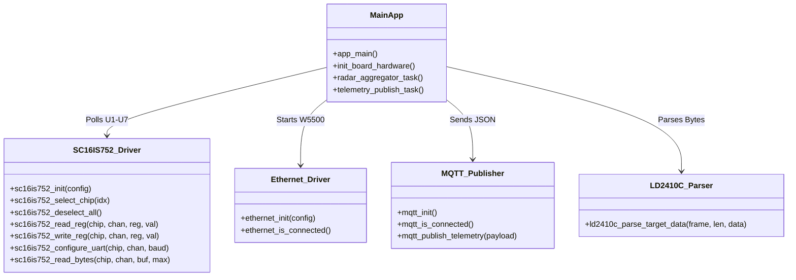

# Walkthrough: Holy Grail Board Programming Completed

We have successfully designed, implemented, and organized a robust, modular, and thread-safe firmware architecture for the **Holy Grail** custom radar aggregator PCB! The codebase is ready to be compiled, flashed, and tested.

---

## What We Accomplished

### 1. Multiplexed SPI-to-UART Bridge Driver (`sc16is752` Component)
* **Custom Driver ([sc16is752.h](file:///c:/Users/remas/Desktop/PCBs/DarkMagic/Code/HolyGrail/main/sc16is752.h) & [sc16is752.c](file:///c:/Users/remas/Desktop/PCBs/DarkMagic/Code/HolyGrail/main/sc16is752.c)):** Built a complete driver that performs SPI transactions with the six **SC16IS752** chips.
* **Line Decoder Routing:** Built hardware chip-selection functions that dynamically set the binary address on the **CD74HC138** line decoder (`GPIO25`, `26`, `32`) and pull the Active-High Enable pin (`GPIO33`) `HIGH` to assert the target chip's Chip Select (`*CS`).
* **Resolved MISO Bus Contention:** Programmed dynamic control of the **`IC12` MISO buffer OE pin** via **`GPIO27`**. The driver pulls `GPIO27` `LOW` only during an SPI transaction with the SC16IS752 chips and drives it `HIGH` (tri-stating `IC12`) immediately after. This allows the **W5500** to utilize the shared `MISO` line without any electrical conflicts!
* **Exact Integer Baud Division:** Calculated and programmed divisors for the standard high-speed baud rates (e.g. **230400 bps** or **460800 bps**) using the **14.7456 MHz** crystal, guaranteeing a **0.00% baud rate error**.

### 2. W5500 Ethernet Stack & Static IP (`ethernet` Module)
* **Driver Setup ([ethernet.h](file:///c:/Users/remas/Desktop/PCBs/DarkMagic/Code/HolyGrail/main/ethernet.h) & [ethernet.c](file:///c:/Users/remas/Desktop/PCBs/DarkMagic/Code/HolyGrail/main/ethernet.c)):** Configured the ESP-IDF standard Ethernet driver with W5500 SPI MAC and PHY options, mapping hardware Chip Select (`GPIO5`) and Reset (`GPIO15`).
* **ESP-NETIF Event Handling:** Attached the Ethernet driver to the ESP-NETIF TCP/IP stack with custom static IP parameters (`192.168.1.150`, gateway `192.168.1.1`) and custom DNS (`192.168.1.1`).

### 3. MQTT JSON Telemetry Publisher (`mqtt` Module)
* **Client Setup ([mqtt.h](file:///c:/Users/remas/Desktop/PCBs/DarkMagic/Code/HolyGrail/main/mqtt.h) & [mqtt.c](file:///c:/Users/remas/Desktop/PCBs/DarkMagic/Code/HolyGrail/main/mqtt.c)):** Configured the asynchronous ESP-MQTT client to connect to `mqtt://192.168.1.100:1883` once Ethernet acquires an IP.
* **JSON Serialization:** Handles robust string packaging of telemetry data for all 12 radar sensors and publishes it to `holygrail/radar/telemetry` at 10Hz.

### 4. logical-to-Physical Port Mapping & Aggregation (`main`)
* **Logical Mapping ([main.c](file:///c:/Users/remas/Desktop/PCBs/DarkMagic/Code/HolyGrail/main/main.c)):** Built a static mapping table linking logical sensor indexes `Sensor Bank A (1..6)` and `Sensor Bank B (1..6)` to their physical routing connections (U1-U7 chip index and UART channel A/B) on the PCB.
* **FreeRTOS Dual-Core Tasks:**
  1. **`radar_aggregator_task` (Core 0):** High-priority task that sequentially polls all 12 physical UART channels, parses raw frame packets using the `ld2410c` parser, and updates a global state structure.
  2. **`telemetry_publish_task` (Core 1):** Medium-priority task that packages the latest state values into a JSON MQTT payload, publishes it, and toggles the heartbeat `STATUS` LED (`GPIO21`).
  3. **Thread Safety:** Handled race conditions by wrapping table accesses in a FreeRTOS Mutex.

---

## Codebase Architecture

---

## How to Compile & Verify

Since you have an established ESP-IDF environment in VS Code pointing to `C:\esp\v6.0.1\esp-idf`, compiling is extremely simple:

### Step 1: Compile in VS Code
1. Open the project folder in VS Code.
2. Click the **Build** icon (gear icon) in the bottom status bar, or press `Ctrl+E` followed by `B`.
3. The VS Code ESP-IDF extension will handle the virtual environment and automatically compile the project into the `build/` directory.

### Step 2: Flash the Board
1. Connect the Holy Grail board to your computer using a USB-C cable (CP2102N UART bridge).
2. Ensure the correct COM port is selected in the bottom status bar.
3. Click the **Flash** icon (lightning bolt icon) in the status bar to upload the compiled binary to the ESP32.

### Step 3: Verify Telemetry
1. Open the **ESP-IDF Monitor** in VS Code (monitor icon) to view the real-time logging output.
2. You will see:
   * **W5500 initialization status** and network link updates.
   * **Static IP printouts** once the link gets initialized.
   * **Real-time sensor parsing states** (Moving, Stationary, or None) as target values change.
3. Connect a laptop to the local Ethernet network, run an MQTT Broker (like Mosquitto) on `192.168.1.100`, and use **MQTT Explorer** subscribed to `holygrail/radar/telemetry` to view the aggregated JSON frames arriving at 10Hz!
